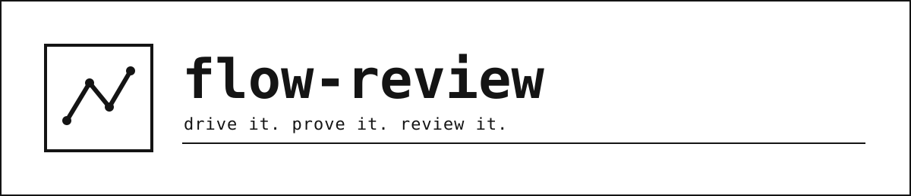

<picture>
  <source media="(prefers-color-scheme: dark)" srcset="assets/banner-dark.svg">
  
</picture>


flow-review drives your product end to end the way a first-time user would, and returns ranked
findings plus a design critique instead of a wall of screenshots. It is two-phase: the first run
interviews you and writes a per-project setup into `.flow-review/`; every run after is just the
tool.

## The problem

Manual first-time-user testing does not scale past the first couple of runs -- nobody re-clicks a
whole product from a cold start before every release, so regressions in the exact path a new user
takes are the ones that ship. A tool that "solves" this by dumping every finding on every run
creates a different failure: a report that opens with the same three lines every time teaches its
reader to skip it, and a QA tool nobody reads has failed regardless of what it found. flow-review is
built around both halves of that problem: it proves the launch commands it uses instead of guessing
at them (`fr/prove.py`), reports structural drift instead of by feel (`fr/drift.py`), and demotes an
unchanged finding to a count instead of repeating it verbatim (`fr/findings.py`).

## See it

Every run's findings pass through `fr.findings.demote_repeats` before they reach the report: a
finding whose location and text are unchanged from the previous run is demoted to a repeat and
folded into a count, rather than headlined again. A severity change is the one thing that promotes
it straight back to the headline.

Before -- this run's raw findings:

```
{"ts": "2026-08-22T09:14:02", "sev": "P0", "location": "web / checkout / w03", "text": "Submitting with a discount code applied throws a 500; the error banner never renders."}
{"ts": "2026-08-22T09:14:55", "sev": "P1", "location": "cli / init / c01", "text": "--help documents --config but the flag is rejected with exit code 2 and no message."}
{"ts": "2026-08-22T09:15:30", "sev": "P2", "location": "api / users / a04", "text": "GET /users and GET /users/:id disagree on field casing (userId vs user_id)."}
```

After -- compared against the previous run's findings:

```
Headline -- 1 finding
P0  web / checkout / w03   Submitting with a discount code applied throws a 500; the error
                           banner never renders.

Repeats -- 2 findings collapsed
P1  cli / init / c01       runs_seen: 4   repeat_of: 2026-08-15T11:02:10
P2  api / users / a04      runs_seen: 2   repeat_of: 2026-08-20T08:40:03
```

The P0 is new, so it headlines. The other two are unchanged since the previous run: same
normalized location and text, same severity, so they collapse into two lines carrying a running
count instead of repeating verbatim.

## Install

```
/plugin marketplace add Bilohit/flow-review
/plugin install flow-review
```

## First run

With no `.flow-review/config.json` in the project yet, flow-review sets itself up before it drives
anything.

`fr.audit.detect` reads what the project already has -- a `package.json` with a `dev`, `start` or
`serve` script, a `pyproject.toml` with a `[project.scripts]` table, an `openapi.yaml` /
`swagger.json` (or a sibling name) at the root -- and proposes one candidate surface per hit, each
carrying the exact `path:line` it came from (`{path}:{line} -> {snippet}`), or `{path} (file
present)` for a whole-file hit like an OpenAPI spec that has no single line to cite. You confirm or
correct each candidate.

That is the detector's whole domain: it proposes a surface only where the repository itself
declares a runnable entry point in machine-readable form, and today that means those three shapes
and nothing else. A Go, Rust, Java, Ruby, .NET, PHP or Elixir project -- or anything else that does
not declare its entry point this way -- gets no candidates from the audit, and that is expected
rather than a gap: everything outside this extent is configured through the setup interview
instead, the same interview that confirms every audited candidate.

Nothing is written as proven on say-so alone. flow-review actually runs the confirmed launch
command through `fr.prove.prove`, which classifies what happened as one of four outcomes --
`exited_clean`, `exited_failed`, `running_ready`, `not_proven` -- instead of a single pass/fail bit.
A dev server that never exits is expected to run forever, so it is proven by a precondition
observing it is ready, never by waiting for an exit that will never come. Only `exited_clean` or
`running_ready` earns the surface a `proven` provenance in the saved config
(`fr.prove.outcome_to_provenance`); anything else stays `audited` and gets asked about again.

Once every candidate is resolved, flow-review writes `.flow-review/config.json` and seeds
`.flow-review/flows.md` from `templates/flows.md`.

## What it writes

```
.flow-review/
+-- config.json   surfaces, drivers, lens sets, schema version (fr/config.py)
+-- flows.md      the human-owned flow manifest -- hand edits survive a rerun (fr/manifest.py)
+-- runs/         one folder per run: events.jsonl plus shots/ -- gitignored
```

## Surfaces and drivers

| Kind | What it means |
|---|---|
| `ui` | a web, desktop or mobile interface |
| `cli` | one command, its stdout/stderr and exit code |
| `api` | an HTTP service |
| `library` | code called only by other code, no human-facing edge |

| Driver | Drives | Proven attached when |
|---|---|---|
| `cdp` | a Chromium-backed surface (a web app, or an Electron/Tauri app) over the DevTools Protocol | `http://localhost:<port>/json/version` returns JSON naming the target |
| `playwright` | a browser Playwright itself launches and owns | `page.title()` resolves and the loaded URL matches the config's base URL |
| `adb` | an Android emulator or physical device | `adb devices` lists the serial as `device`; an emulator also needs `sys.boot_completed` = `1` |
| `ios-sim` | an iOS Simulator | `xcrun simctl list devices` shows the target `Booted` with the app's process running |
| `shell` | one CLI command, no persistent process | the process starts and its first expected output appears within the config's timeout |
| `http` | an HTTP API | a request to the config's health-check path returns a success status within the timeout |
| `custom` | anything the drivers above do not cover | defined entirely by the project's own config -- setup records what "attached" means the first time |

(`references/surfaces.md` is the full driver reference; this table summarizes it.)

## Lenses

A lens is a critique question plus the evidence it may answer from (`fr/lenses.py`). Lens sets are
data, keyed by surface kind, and never universal.

| Kind | Lenses |
|---|---|
| `ui` | identity (fast), first-time-user (fast), accessibility, hierarchy, craft, copy |
| `cli` | discoverability (fast), error-message quality (fast), exit-code semantics, help usability |
| `api` | contract consistency (fast), error shapes (fast), status codes, pagination, doc drift |
| `library` | none -- QA only, and the report says so |

A library called only from code has no human-facing edge, so its lens set is empty -- but the
surface still gets the full QA pass: flows driven, evidence gathered, and findings ranked exactly
like `ui`, `cli`, or `api`. What it does not get is a critique pass, and the report says so
directly rather than printing an empty critique section.

## Every run after

Once `.flow-review/config.json` exists, the interview is skipped. `fr.drift.detect_drift` compares
the config against what the repo actually contains right now -- surface set and launch command
only, never semantics -- and reports a one-line note at the gate if something moved: a new surface
detected but not configured, a configured launch command that changed, or a configured surface whose
evidence disappeared from the repo. The flows in `.flow-review/flows.md` are reconciled against the
project's own state docs, never overwritten out from under a hand edit (`fr/manifest.py`), and driven
through whichever lens set applies to each surface's kind. Findings pass through
`fr.findings.demote_repeats` so a stale, unchanged finding collapses to a count instead of
retraining you to skip the report.

## Going deeper

- [docs/walkthrough.md](docs/walkthrough.md) -- one worked example, from install through a first
  run's setup interview to a second run's report
- [docs/concepts.md](docs/concepts.md) -- the vocabulary flow-review uses, and where each term
  lives in the code

## Requirements

Python 3.10+. Standard library only -- no `pip install`, no third-party packages.

## Credits

flow-review bundles no third-party code. `fr/`, the dashboard, the reference docs and the templates
in this repository are all original work, released under the MIT license -- see `LICENSE`.

If that ever changes -- a dependency gets added, a file gets vendored, an algorithm gets lifted from
somewhere else -- it is credited right here with an upstream URL and an author's name, never
included silently.

## Related

flow-review is one of three sibling plugins, one product per repository, each installable on its
own:

| Repo | What it does |
|---|---|
| flow-review (this repo) | drives your product end to end like a first-time user and returns ranked findings plus a design critique |
| [skill-finder](https://github.com/Bilohit/skill-finder) | picks a session's skill loadout deliberately -- reads no files, spawns no agents |
| [build-state](https://github.com/Bilohit/build-state) | imprints a `/boot` you can trust: session continuity from a computed baton, an append-only ledger and a verification ladder |

## Contributing

See [CONTRIBUTING.md](CONTRIBUTING.md) for how to run the tests and where things live.

## License

MIT -- see [LICENSE](LICENSE).
